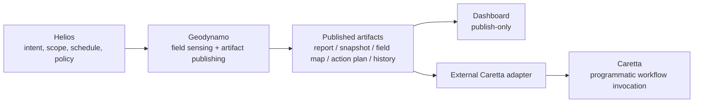
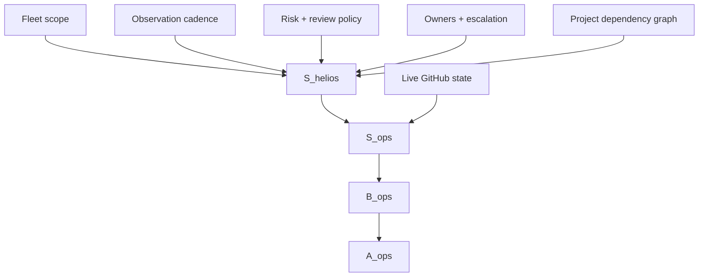

# Helios Parent System Proposal

Helios is proposed as the parent system above Geodynamo. The name means "sun",
which makes it a good fit for the upstream source of operational illumination:
policy, schedule, project inventory, scope, and high-level intent. Helios should
not be a replacement for Geodynamo or Caretta. It should sit above them as the
system that defines what should be observed, when it should be observed, and
which published fields matter.

## Core Hypothesis

Helios is the source-of-intent layer. Geodynamo is the field publisher. Caretta
remains a downstream programmatic consumer.

```text
Helios -> Geodynamo -> published artifacts -> dashboard
Helios -> Geodynamo -> published artifacts -> external Caretta adapter -> Caretta
```

Helios owns orbit and illumination. Geodynamo owns field sensing and
publication. Caretta owns workflow navigation after an external adapter binds
published artifacts to programmatic control.



## Responsibility Split

| Layer | Role | Owns | Must not own |
| --- | --- | --- | --- |
| Helios | Parent intent and operating envelope | project inventory, schedules, policy defaults, fleet scope, retention posture | per-run GitHub telemetry, dashboard controls, Caretta workflow execution |
| Geodynamo | Read-only field publisher | collection, normalization, hazard classification, drift, history artifacts, dashboard publication | Caretta workflow internals, mutation, operator approvals |
| Caretta adapter | Programmatic consumer | mapping generic field artifacts into Caretta workflow routes | Geodynamo collection, dashboard behavior |
| Caretta | Workflow execution system | CLI or GitHub Action invocation under explicit policy | Geodynamo internals, publish dashboard behavior |

The dependency direction should stay one-way. Helios may configure Geodynamo.
Geodynamo should not know whether Caretta exists. Caretta should consume
published artifacts through an adapter, not through an internal Geodynamo API.

## What Helios Adds

Helios gives Geodynamo a parent context without making Geodynamo more coupled.
Good Helios responsibilities include:

- fleet inventory: which repositories or projects are in scope;
- observation cadence: which schedules run and at what frequency;
- retention policy: how long artifacts and state are meaningful;
- publication policy: where reports, dashboards, and artifacts are published;
- risk posture: default priority, risk, and review expectations by project;
- illumination windows: time ranges where automation should watch more closely;
- governance metadata: owners, escalation paths, and project grouping;
- dependency graph: which projects affect other projects downstream.

Helios should express those as declarative inputs. Geodynamo can read them as
configuration. That preserves a natural dependency-injection model:

```text
helios manifest -> geodynamo config -> geodynamo artifacts
```

## Candidate Manifest

Helios could publish a manifest consumed by Geodynamo. The exact format can
evolve, but it should stay generic and Caretta-neutral.

```json
{
  "generatedAt": "2026-06-23T00:00:00.000Z",
  "fleet": "geoffsee",
  "retentionDays": 30,
  "publication": {
    "dashboard": true,
    "artifacts": ["report", "snapshot", "field-map", "action-plan", "history"]
  },
  "defaults": {
    "workflowNames": ["Autopilot"],
    "allowedActions": ["observe", "report"],
    "reviewMode": "required"
  },
  "projects": [
    {
      "repo": "geoffsee/midi-vibe",
      "priority": "high",
      "risk": "medium",
      "owners": [],
      "deploy": {
        "environment": "release",
        "policy": "review open autopilot PRs before release tagging"
      }
    }
  ]
}
```

This resembles Geodynamo's project configuration but moves the fleet-level
source of truth upward. Geodynamo can still own its local derived config, but
Helios becomes the parent authority for scope and policy.

## Information Model

In the earlier Caretta notes, the magnetic field vector becomes a compact
sensory code. Helios can be modeled as the upstream source term for the
operational field.

```text
S_helios = {fleet scope, schedules, policy, ownership, risk, dependency graph}
S_ops = project_state(S_helios, GitHub_state)
B_ops = geodynamo_field(S_ops)
A_ops = publish(B_ops)
```

| Symbol | Operational meaning |
| --- | --- |
| `S_helios` | Parent source of intent and observation scope. |
| `S_ops` | Concrete operational state derived from Helios scope plus live project state. |
| `B_ops` | Geodynamo field: hazards, drift, routes, actions, and links. |
| `A_ops` | Published artifacts consumed by dashboard and downstream adapters. |



## Boundary Rules

Helios should make Geodynamo easier to configure, not more entangled.

- Helios may define fleet scope and default policy.
- Helios may generate or validate Geodynamo config.
- Helios may decide which Geodynamo publications are enabled.
- Helios may declare retention and scheduling intent.
- Helios should not call Caretta directly through Geodynamo.
- Helios should not make the dashboard a control surface.
- Helios should not require Geodynamo to import Caretta-specific schemas.
- Helios should not hide raw Geodynamo artifacts behind a higher-level summary.

The control path stays downstream and programmatic:

```text
published artifacts -> external adapter -> Caretta CLI / Caretta GitHub Action
```

## Downstream Effects

If Helios exists, downstream systems should become more coherent without
changing Geodynamo's core contract.

| Downstream surface | Expected effect |
| --- | --- |
| Geodynamo config | Less manual drift in project lists, retention, schedules, and risk defaults. |
| Geodynamo artifacts | More consistent context across projects because parent policy is shared. |
| Dashboard | Clearer fleet framing while remaining publish-only. |
| Caretta adapter | Better workflow routing because project priority and review policy are explicit. |
| Human review | Easier escalation because ownership and risk are declared upstream. |
| Future automation | Safer expansion because each layer has a narrow responsibility. |

## Failure Modes

| Failure mode | Effect | Mitigation |
| --- | --- | --- |
| Helios becomes too broad | It turns into a second Geodynamo or a hidden control plane. | Keep Helios declarative: scope, policy, schedule, ownership. |
| Geodynamo depends on Caretta through Helios | Circular dependency reappears indirectly. | Keep Helios manifests Caretta-neutral. |
| Dashboard gains controls | Publish surface becomes an accidental operations console. | Dashboard remains read-only and links outward only. |
| Policy hides reality | Parent defaults obscure project-specific hazards. | Geodynamo must still publish raw field and snapshot artifacts. |
| Overcentralized schedules | Every project gets the same observation cadence despite different risk. | Allow project-level cadence overrides in Helios. |

## Open Questions

- Should Helios be a separate repository, a manifest format, or a small package
  in the same workspace?
- Should Geodynamo consume Helios directly, or should Helios generate
  `geodynamo-projects.json` as a build artifact?
- Should Helios model project dependencies as a graph immediately, or start
  with flat fleet metadata?
- Should Helios own publication destinations, or only publication policy?
- Should Helios track non-GitHub signals later, or should it stay GitHub-fleet
  oriented until the Geodynamo field model stabilizes?

## Working Prediction

Helios is useful if it reduces configuration drift and makes field publication
more coherent without adding a control dependency. The test is straightforward:
Geodynamo should be able to run from Helios-provided scope and policy, publish
the same neutral artifacts, and remain ignorant of Caretta. If that holds,
Helios is a good parent system rather than another control plane.
