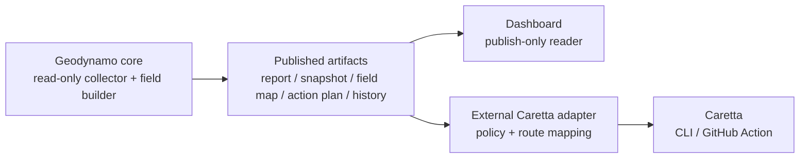

# Caretta Over Geodynamo Working Hypothesis (v2)

Status: working hypothesis / experiment candidate  
Date: 2026-06-23

This v2 revises [Caretta Over Geodynamo Working Hypothesis](./04-caretta-driven-geodynamo-working-hypothesis.md) by turning the original architectural synthesis into a more testable contract. It preserves the main boundary from v1: Geodynamo remains a read-only field publisher, the dashboard remains publish-only, and Caretta acts only downstream through an explicit external adapter and programmatic policy gate.

It builds on:

- [geoffsee/caretta](https://github.com/geoffsee/caretta)
- [Caretta Caretta Field Vectors](./01-caretta-caretta-field-vectors.md)
- [Caretta Caretta Information Primitives](./02-caretta-caretta-information-primitives.md)
- [Caretta Caretta Information Primitives (v2)](./03-caretta-caretta-information-primitives-v2.md)
- [Helios Parent System Proposal (v2)](./07-helios-parent-system-proposal-v2.md)

## Core Claim

Caretta can operate as a bounded downstream workflow navigator over Geodynamo artifacts. The useful unit is not a dashboard button or an embedded Geodynamo integration. The useful unit is a compact route contract, `Z_caretta`, derived outside Geodynamo from published artifacts and consumer policy.

```text
S_ops = {repos, runs, PRs, failures, owners, deploy context, history}
B_ops = geodynamo_field(S_ops)
A_ops = publish(B_ops)
Y_ops = A_ops + consumer_context + temporal_noise
Z_caretta = phi_caretta(Y_ops)
U_ops = policy(Z_caretta, M_ops, C_ops)
```

The testable claim is:

> Downstream decisions made from `Z_caretta` should be nearly as useful as decisions made from the full raw operational state, while requiring less review time, producing fewer unsafe route choices, and preserving source links for audit.

## Dependency Boundary

There must be no circular dependency:

```text
Geodynamo core -> published artifacts -> dashboard
Geodynamo core -> published artifacts -> external Caretta adapter -> Caretta CLI / Caretta GitHub Action
```

Geodynamo must not import, call, configure, or name Caretta workflow internals. It publishes generic operational artifacts: reports, snapshots, field maps, action plans, history, and dashboard assets. A separate adapter may bind those artifacts to Caretta workflows.



The dashboard does not dispatch, mutate, approve, retry, label, merge, or invoke workflows.

## Terminology

| Term | Meaning |
| --- | --- |
| `intent` | What should be observed and why. Intent is normally upstream, eventually from Helios. |
| `policy` | What publication or programmatic actions are permitted. Policy constrains action but does not claim the field is healthy. |
| `state` | What is currently true in GitHub/project operations. |
| `field` | Geodynamo's derived representation of operational state: hazards, drift, actions, links, and route pressure. |
| `route` | Downstream interpretation used to choose a workflow, target, and execution mode. |
| `Z_caretta` | A compact, inspectable route object emitted by the external adapter. |

## Candidate `Z_caretta` Schema

`Z_caretta` should be a route contract, not a hidden prompt. It must be specific enough to explain why a Caretta invocation is safe, unnecessary, or blocked.

```json
{
  "schemaVersion": "caretta.geodynamo.route.v1",
  "generatedAt": "2026-06-23T15:30:00.000-05:00",
  "repo": "geoffsee/midi-vibe",
  "target": {
    "type": "pull_request",
    "id": "123",
    "url": "https://github.com/geoffsee/midi-vibe/pull/123"
  },
  "attention": "urgent",
  "hazardLevel": "blocked",
  "workflow": "code-review",
  "preset": "autopilot-pr-review",
  "agent": "default",
  "mode": "review-gated",
  "confidence": "medium",
  "reason": "failed autopilot run with open PR queue before release tagging",
  "sourceLinks": [
    {
      "kind": "field-map",
      "url": "./field-map.json"
    },
    {
      "kind": "action-plan",
      "url": "./action-plan.json"
    }
  ],
  "policy": {
    "allowedActions": ["observe", "report"],
    "autoAllowed": false,
    "reviewRequired": true
  }
}
```

### Required Fields

Before any Caretta invocation is allowed, the adapter must provide:

- `schemaVersion`
- `generatedAt`
- `repo`
- `attention`
- `workflow` or an explicit `observe` route
- `mode`
- `confidence`
- `reason`
- at least one `sourceLinks[]` entry
- policy summary showing whether automation is allowed

If `target` is missing, the route may only use `observe`, `issue`, `loop`, or `dry-run` modes unless local adapter policy declares a safe fallback.

### Suggested Enums

| Field | Values |
| --- | --- |
| `attention` | `urgent`, `next`, `observe` |
| `hazardLevel` | `blocked`, `watch`, `clear`, `unknown` |
| `workflow` | `code-review`, `fix-pr`, `issue`, `loop`, `housekeeping`, `refresh-docs`, `observe` |
| `mode` | `dry-run`, `review-gated`, `auto`, `none` |
| `confidence` | `high`, `medium`, `low` |

## Policy Boundary

Policy may appear at several layers, but the direction must remain strict:

1. Helios or project config declares the maximum permitted policy.
2. Geodynamo reads config as context and may publish it as neutral artifact data.
3. Geodynamo does not execute policy and does not call Caretta.
4. The Caretta adapter may only choose actions within the published/project maximum and its own stricter local policy.
5. Caretta executes only the explicit workflow invocation selected by the adapter or human operator.

`allowedActions` should be interpreted as a ceiling, not an instruction. For example, if `allowedActions` is `["observe", "report"]`, the adapter may emit `dry-run` or `observe` routes but must not emit `auto` mutation routes.

## Routing Precedence

Overlapping field conditions are expected. The adapter should resolve them with conservative precedence:

1. Collector errors, missing snapshots, or stale generated timestamps produce `unknown` or `blocked` routes and never produce write automation.
2. Deployment-sensitive projects require `review-gated` mode for failed runs, documentation drift, or open autopilot PR queues.
3. Repeated failures outrank one-off failures.
4. Failed runs with a clear pull request target outrank general housekeeping and stale-branch routes.
5. Crowded PR queues reduce automation aggressiveness even when an individual route looks clear.
6. Low-confidence routes default to `dry-run` or `observe`.
7. Clear routes with low pressure produce no Caretta write workflow.

## Workflow Mapping

| Published field condition | Route | Default mode | Notes |
| --- | --- | --- | --- |
| Collector error, missing data, or stale artifact | `observe` | `dry-run` | Inspect report and raw snapshot before action. |
| Failed autopilot run with a clear PR target | `fix-pr` or `code-review` | `review-gated` | Use `fix-pr` only if policy allows targeted PR work. |
| Open autopilot PR queue | `code-review` | `review-gated` | Crowded queues should not increase automation pressure. |
| Repeated failed run without clear PR target | `issue` or `loop` | `dry-run` | Convert ambiguity into an investigation route. |
| Documentation drift | `refresh-docs` | `review-gated` | Keep source links to docs and drift signals. |
| Stale tracker, branches, or repository hygiene | `housekeeping` | `dry-run` | Never outranks active failures. |
| Clear route with low pressure | `observe` | `none` | No write workflow. |

## Evaluation Criteria

The v2 experiment should compare decisions made from raw snapshots against decisions made from `Z_caretta`. The adapter is useful only if it preserves decision quality while reducing review burden and unsafe routing.

| Metric | Target direction |
| --- | --- |
| Reviewer time-to-decision | Lower for `Z_caretta` decisions. |
| Agreement with raw-state expert decision | Same or higher. |
| False urgent rate | Lower or unchanged. |
| False clear rate | Lower. |
| Workflow misroute count | Lower. |
| Unsafe automation recommendations | Zero. |
| Recommendations with source links | 100%. |
| Ambiguous `observe` states | Lower over repeated runs. |
| Repeated failure recognition | Faster than raw snapshot review alone. |

### Minimum Experiment

1. Select recent Geodynamo runs for the configured repositories.
2. Have reviewers choose downstream actions from raw snapshots alone.
3. Generate `Z_caretta` outside Geodynamo from field map, action plan, and history.
4. Have reviewers choose downstream actions from `Z_caretta` alone.
5. Compare decisions, review time, misroutes, confidence, and source-link sufficiency.
6. Confirm that no Geodynamo code imports or invokes Caretta.

## Failure Modes

| Failure mode | Downstream effect | Mitigation |
| --- | --- | --- |
| Over-compression | Important job or PR detail disappears behind a coarse hazard label. | Require source links and raw snapshot audit path. |
| Stale memory | Drift is computed against old or missing state. | Require generated timestamps and baseline history checks. |
| Policy leakage | Geodynamo or the dashboard becomes a hidden control plane. | Keep policy execution in the adapter/Caretta layer only. |
| Wrong workflow selection | Caretta runs an inappropriate workflow. | Emit route, mode, target, confidence, and reason separately. |
| Unsafe `--auto` use | Automation mutates state before review. | Default to `dry-run`; require explicit allowed action and local adapter approval. |
| Missing field data | API failures look like healthy routes. | Treat collector errors as hazards. |
| Feedback amplification | Repeated `urgent` routes increase pressure rather than reduce it. | Add cooldowns and queue-pressure checks in adapter policy. |

## Non-Goals / Prohibited Couplings

- Do not make the Geodynamo dashboard a control surface.
- Do not add Caretta workflow names to Geodynamo core logic.
- Do not call Caretta from Geodynamo collection, report generation, or dashboard publication.
- Do not treat `allowedActions` as permission to automate without adapter policy.
- Do not hide raw artifacts behind `Z_caretta`.
- Do not emit routes without source links.

## Working Prediction

The hypothesis is working if a downstream adapter can compute `Z_caretta` from Geodynamo artifacts, preserve or improve route decisions, reduce review time, and keep all workflow execution outside Geodynamo.

The strongest acceptable first result is modest: fewer ambiguous reports, more consistent `urgent` / `next` / `observe` ordering, and zero unsafe automation recommendations. The architecture should optimize for clear handoff and safe routing before attempting autonomous mutation.