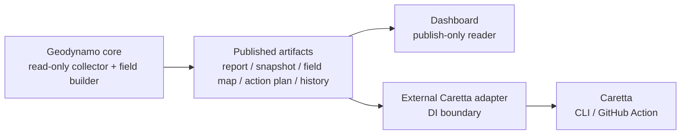
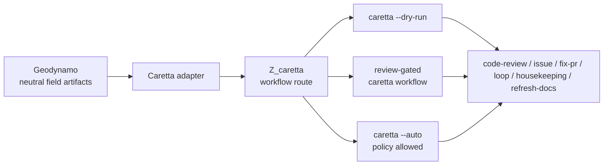
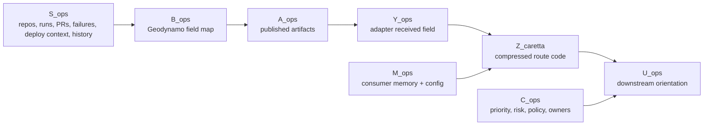
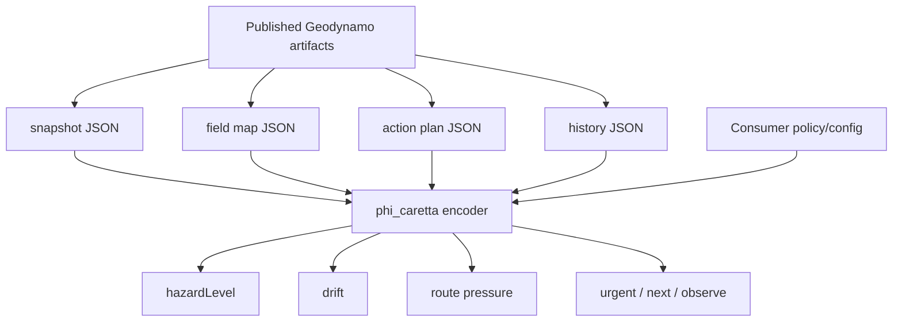
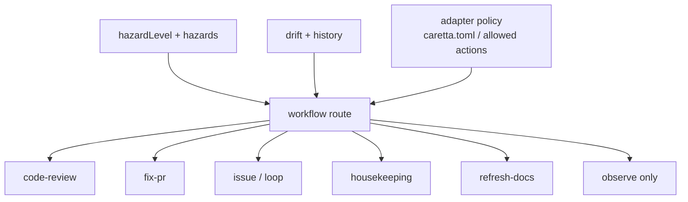
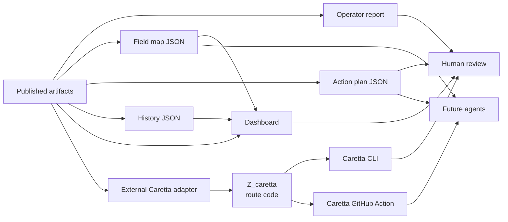
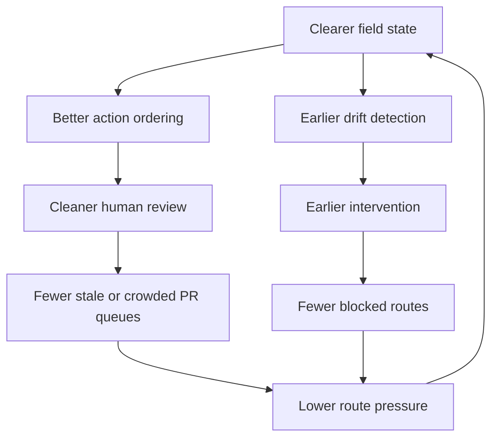
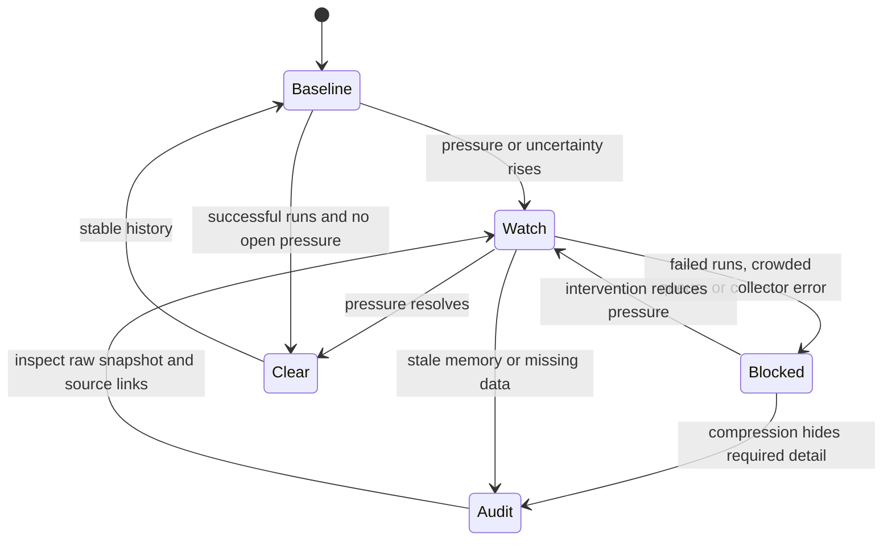

# Caretta Over Geodynamo Working Hypothesis

This document synthesizes the working hypothesis for using an instance of
Caretta downstream of Geodynamo to shape programmatic effects. It builds on:

- [geoffsee/caretta](https://github.com/geoffsee/caretta)
- [Caretta Caretta Field Vectors](./caretta-caretta-field-vectors.md)
- [Caretta Caretta Information Primitives](./caretta-caretta-information-primitives.md)
- [Caretta Caretta Information Primitives (v2)](./caretta-caretta-information-primitives-v2.md)

The goal is not to make Geodynamo or its dashboard a control plane. The
dashboard remains a publish-only dashboard. The actual Caretta project is a
workflow-driven agent system with CLI, desktop, web, and GitHub Actions
surfaces. In this synthesis, Geodynamo stays the read-only field publisher,
while Caretta is a downstream workflow navigator that can consume published
field artifacts and act only through explicit programmatic policy. For this
architecture, the control surface is programmatic: CLI or GitHub Actions, not
the Geodynamo dashboard.

The working hypothesis is that Caretta can act as a bounded
sensory/controller instance outside Geodynamo: it compresses Geodynamo's
published operational field into task-relevant signals, chooses attention and
routing priorities, and leaves downstream systems with clearer state, lower
ambiguity, and safer next actions.

## Dependency Boundary

There must be no circular dependency. The natural dependency-injection model is
one-way:

```text
Geodynamo core -> published artifacts -> dashboard
Geodynamo core -> published artifacts -> Caretta adapter -> programmatic Caretta invocation
```

Geodynamo should not import, call, configure, or name Caretta workflow
internals. It publishes generic operational artifacts: report, snapshot, field
map, action plan, history, and dashboard assets. A separate programmatic
consumer may bind those artifacts to Caretta workflows.



The only control surface is programmatic and downstream of the artifact
boundary. The dashboard does not dispatch, mutate, approve, retry, label, merge,
or invoke workflows.

## Caretta Project Alignment

Caretta is not only a metaphor. The repository describes it as
workflow-driven agents: a system for reading a codebase's shifting operational
signals and moving work forward through named workflows. Relevant surfaces
include:

- CLI workflows such as `code-review`, `issue`, `fix-pr`, `loop`,
  `housekeeping`, and `refresh-docs`;
- workflow presets selected with `--preset`;
- agent selection with `--agent`;
- explicit execution modes such as `--dry-run` and `--auto`;
- project configuration through `caretta.toml`;
- GitHub Actions integration through `geoffsee/caretta-action`.

Only the programmatic Caretta entry points belong in the Geodynamo integration
path. Desktop and web surfaces may exist in Caretta generally, but they should
not become Geodynamo control surfaces.

For a downstream Caretta adapter, this means `Z_caretta` should not remain an
abstract route code. It should be interpretable as a Caretta invocation recipe:

```text
Z_caretta -> {
  repo,
  target,
  workflow,
  preset,
  agent,
  mode,
  reason,
  source_links
}
```

The Geodynamo field map and action plan remain Caretta-neutral. The adapter
uses them to decide whether the next Caretta move is a dry-run review, a
review-gated workflow, or an automated workflow allowed by project policy.



## Core Hypothesis

Geodynamo is the field generator and publisher. It watches repositories,
Actions runs, open autopilot pull requests, collection errors, and retained
history. Caretta is not a dependency of Geodynamo. A downstream Caretta adapter
receives the published operational field, reduces it to compact navigation
variables, and emits a route-oriented interpretation that can be translated
into a Caretta workflow when policy allows.

```text
S_ops = {repos, runs, PRs, failures, owners, deploy context, history}
B_ops = geodynamo_field(S_ops)
A_ops = publish(B_ops)
Y_ops = A_ops + consumer_context + temporal_noise
Z_caretta = phi_caretta(Y_ops)
U_ops = policy(Z_caretta, M_ops, C_ops)
```

| Symbol | Operational meaning |
| --- | --- |
| `S_ops` | Hidden operational state across projects and automation routes. |
| `B_ops` | Geodynamo's field map: hazards, drift, routes, links, and actions. |
| `A_ops` | Published Geodynamo artifacts. This is the dependency boundary. |
| `Y_ops` | The adapter's received field after consumer context and temporal noise. |
| `phi_caretta()` | Downstream Caretta adapter encoder from published artifacts to compact navigation code. |
| `Z_caretta` | The task-shaped code used for routing: urgency, route pressure, drift, and confidence. |
| `M_ops` | Downstream memory: artifact history, previous route outcomes, project config, known route policy. |
| `C_ops` | Consumer context: project priority, risk, deploy policy, owners, and current maintenance intent. |
| `U_ops` | Downstream programmatic orientation: Caretta workflow selection, mode, target, and agent prompt shape. |

The testable claim is similar to the Caretta sensory sufficiency claim:

> Downstream behavior conditioned on `Z_caretta` should be nearly as useful as
> downstream behavior conditioned on the full raw operational state, while being
> cheaper, clearer, and less error-prone.



## Caretta As Encoder

A Caretta adapter should behave like an Information Bottleneck over
Geodynamo's published field artifacts. It should discard raw detail that does
not change the next route decision, while preserving the signals that matter
for operational navigation.

```text
phi* = argmin_phi   MI(Y_ops; Z_caretta) - beta * MI(Z_caretta; T_ops)
```

`T_ops` is the task variable. For downstream consumers of Geodynamo artifacts,
useful task variables include:

- which project needs intervention now;
- whether a route is blocked, watchful, or clear;
- whether pressure is increasing or resolving;
- whether an autopilot PR queue is safe to advance;
- whether a deployment route needs human review before more automation runs;
- whether the current field state is baseline, drift, or regression.

In concrete terms, the downstream Caretta state can be built from generic
Geodynamo artifacts:

| Published Geodynamo signal | Downstream Caretta code role |
| --- | --- |
| `hazardLevel` | Coarse route state: blocked, watch, or clear. |
| `hazards[]` | Local disturbance labels explaining the route state. |
| `drift` | Change detector against prior field memory. |
| `actions[]` | Decoded route instructions ordered by urgency. |
| `routes[]` | Human-readable path options and constraints. |
| `summary` | Fleet-level field intensity. |
| `history.snapshots[]` | Memory trace for downstream trend and persistence checks. |



## Programmatic Control Boundary

Caretta does not drive Geodynamo. Caretta drives downstream programmatic action
from Geodynamo's published field. Geodynamo emits the same neutral artifacts no
matter which consumer reads them.

1. Field publication

   Geodynamo collects the raw operational field from GitHub and project config.
   It publishes generic artifacts without depending on Caretta.

2. Dashboard publication

   The dashboard reads the artifacts and presents them. It does not dispatch,
   retry, approve, merge, label, or invoke any workflow.

3. Downstream compression

   A Caretta adapter collapses published runs, jobs, PRs, errors, and
   timestamps into a compact code: hazard class, drift deltas, route pressure,
   and action priority.

4. Memory comparison

   The adapter can compare the current code against artifact history or its own
   memory. A single failed run is different from a repeating failure. A stable
   open PR queue is different from a growing one.

5. Route selection

   The adapter emits ordered attention: urgent, next, observe. It can also map
   that attention into a concrete Caretta workflow target such as
   `code-review`, `fix-pr`, `issue`, `loop`, `housekeeping`, or `refresh-docs`.

6. Programmatic invocation

   A human, scheduled workflow, or repository-specific policy can convert the
   routed action into a Caretta CLI or GitHub Action invocation. `--dry-run`
   should be the default evaluation mode; `--auto` should only appear where
   downstream policy and allowed actions make automation explicit.

## Workflow Mapping

The downstream route code should point at Caretta workflows without hiding the
reason for the route. This mapping lives outside Geodynamo.

| Published field condition | Caretta workflow route | Default mode |
| --- | --- | --- |
| Failed autopilot run with a clear PR target | `fix-pr` or `code-review` | review-gated |
| Open autopilot PR queue | `code-review` | review-gated |
| Issue queue needs work | `issue` or `loop` | dry-run first |
| Stale tracker, branches, or repository hygiene | `housekeeping` | dry-run first |
| Documentation drift | `refresh-docs` | review-gated |
| Unclear field or collector errors | no write workflow; inspect report and raw snapshot | dry-run only |
| Clear route with low pressure | observe; no Caretta write workflow | none |



## Downstream Effects

The expected downstream effects are cumulative rather than dramatic. The system
should improve the quality of attention and reduce unnecessary automation
pressure.

| Surface | Expected effect |
| --- | --- |
| Operator report | Shorter path from field state to concrete next action, still published by Geodynamo. |
| Action plan JSON | Stable Caretta-neutral handoff because priorities are explicit. |
| Field map JSON | Shared vocabulary for hazards, routes, and drift. |
| History JSON | Better distinction between transient events and persistent route pressure. |
| Dashboard | Faster human scan of fleet state and 30-day trajectory, with no control affordances. |
| Autopilot PR review | Less tendency to open or advance work when queues are crowded. |
| Deployment route | More visible gate when release policy requires review. |
| Caretta CLI | More concrete workflow choice, target, mode, and prompt context. |
| Caretta GitHub Action | Safer scheduled or event-driven execution because the route is preclassified. |
| Future agents | Better prompts because the route state is already compressed and linked. |



## Positive Feedback Loops

Caretta over Geodynamo can produce useful feedback loops when downstream
programmatic work changes the repository state that Geodynamo observes in later
runs. This is not a code dependency; it is a world-state feedback loop.

```text
clearer field -> better action ordering -> cleaner human review
cleaner review -> fewer stale PRs -> lower route pressure
lower pressure -> clearer field
```

and:

```text
history -> drift detection -> early intervention
early intervention -> fewer blocked routes
fewer blocked routes -> lower fleet hazard intensity
```

The value is not that Caretta predicts everything. The value is that it makes
the next state easier to classify and safer to route.



## Failure Modes

The hypothesis fails if the Caretta code loses task-relevant information or
creates false confidence.

| Failure mode | Downstream effect | Mitigation |
| --- | --- | --- |
| Over-compression | Important job or PR detail disappears behind a coarse hazard label. | Keep source links and raw snapshot artifacts. |
| Stale memory | Drift is computed against old or missing state. | Publish generated timestamps and baseline states. |
| Magnetic doubles analog | Different projects produce similar hazard signatures but need different action. | Include project priority, risk, owner, and deploy context in `C_ops`. |
| Feedback amplification | Repeated "urgent" labels create more automation pressure instead of review. | Put automation limits in the downstream adapter policy. |
| Wrong workflow selection | Caretta runs the wrong workflow for the field condition. | Emit workflow route, target, mode, and source links separately for inspection. |
| Unsafe `--auto` use | Automation applies changes before the field state is understood. | Default to `--dry-run`; require explicit allowed action and project policy for `--auto`. |
| Missing field data | API errors look like operational health. | Treat collector errors as hazards, not absence of hazards. |
| Dashboard authority creep | A visual summary is mistaken for a control surface. | Preserve read-only design and link outward for manual action. |



## Design Constraints

The Caretta instance should preserve these constraints:

- Geodynamo and the dashboard remain read-only by default;
- Geodynamo must not import, call, configure, or name Caretta workflow
  internals;
- dependency direction is one-way: Geodynamo publishes artifacts, external
  consumers read them;
- Caretta execution must be explicit through programmatic CLI or GitHub
  Actions surfaces;
- `--dry-run` is the default handoff mode for uncertain routes;
- `--auto` requires explicit downstream project policy and allowed actions;
- no secrets in published outputs;
- no repository mutation from the dashboard;
- every action recommendation links back to inspectable source state;
- history is retained only long enough to detect useful drift;
- raw detail remains available for audit when the compressed code is
  insufficient;
- project config controls risk, priority, allowed actions, and deploy context.

## Working Prediction

If a Caretta adapter is a downstream encoder over Geodynamo artifacts,
programmatic consumers should show:

- fewer ambiguous reports;
- more consistent urgent/next/observe ordering;
- more concrete Caretta workflow selection;
- faster recognition of persistent failures;
- clearer distinction between blocked routes and watchful routes;
- less autopilot queue crowding;
- easier human review of deployment-sensitive projects;
- better future agent handoff through stable JSON artifacts.

The near-term experiment is to compare downstream decisions made from raw
snapshots alone against decisions made from `Z_caretta`, where `Z_caretta` is
computed outside Geodynamo from field map, action plan, and history. If the
Caretta-compressed state leads to the same or better interventions with less
review time, without adding a Geodynamo-to-Caretta dependency, the synthesis is
working.
