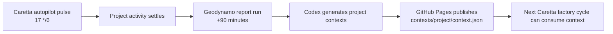
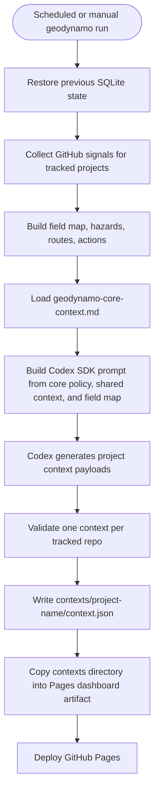
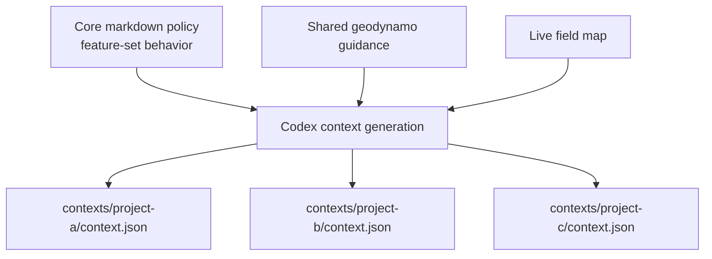
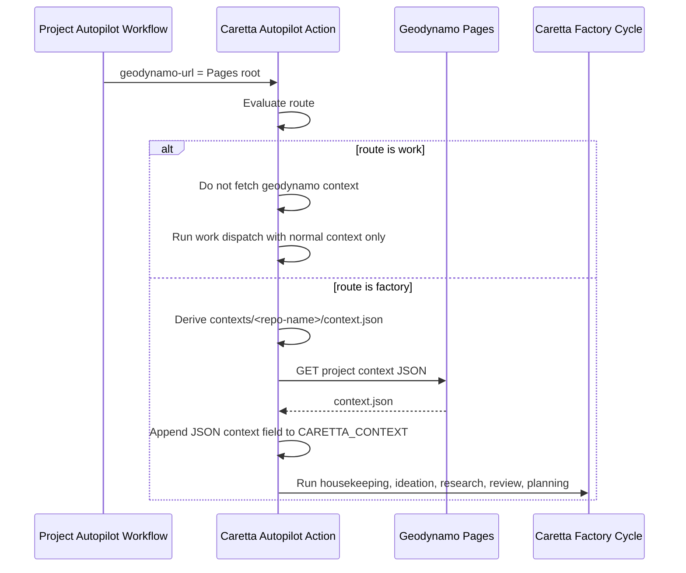
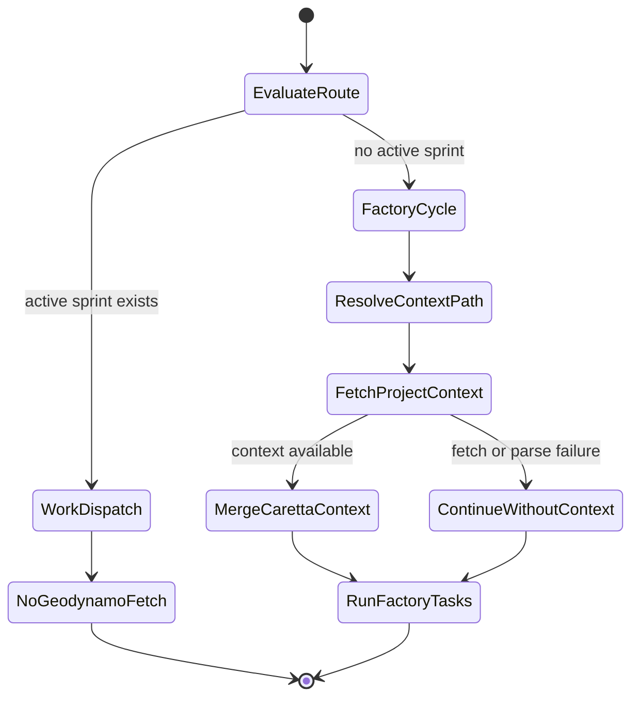

# Geodynamo Factory Context Specification

## Status

Prototype specification.

## Purpose

Geodynamo manages a group of Caretta autopilot projects by publishing
factory-cycle context files from a GitHub Pages deployment. Each Caretta
project remains unaware of the other managed projects. It only declares the
root URL for its geodynamo instance, and Caretta derives the project-specific
context path from the current repository name.

This mechanism is intended to steer Caretta factory cycles toward coherent
sets of user-facing features. Operational signals such as failed CI, crowded
agent PR queues, stale runs, and open issues inform scope and risk, but the
primary generated context should still drive visible product movement whenever
possible.

## Non-goals

- No root-level `geodynamo-factory-context.json` artifact.
- No legacy path compatibility.
- No project-to-project awareness inside generated project context.
- No geodynamo context injection into Caretta work-dispatch cycles.

## Canonical published paths

Geodynamo publishes exactly one context JSON per tracked project:

```text
/contexts/<project-name>/context.json
```

For repository `geoffsee/midi-vibe`, the project name is `midi-vibe`, so the
published path is:

```text
/contexts/midi-vibe/context.json
```

Caretta projects configure only the geodynamo Pages root URL. Caretta derives
the final URL as:

```text
<geodynamo-url>/contexts/<current-repo-name>/context.json
```

## Inputs

### Static geodynamo configuration

`geodynamo-projects.json` provides:

- `projects`: tracked repositories and metadata.
- `factoryContext`: shared fleet-level context and guidance.
- `coreContextPath`: path to the markdown policy document used by Codex.

### Core context markdown

`geodynamo-core-context.md` defines the chief behavior for context generation.
The default document instructs Codex to prioritize cohesive sets of
user-facing features, with maintenance and cleanup treated as support work
unless they directly unblock user-visible capability.

### Live field signals

Geodynamo collects current project state from GitHub:

- recent Caretta Autopilot workflow runs
- failed or active runs
- failed jobs and steps
- open autopilot PRs
- open issues
- drift from previous SQLite state
- computed hazards, routes, and actions

## Output schema

Each generated `context.json` uses schema `geodynamo.project-context.v1`.

```json
{
  "schema": "geodynamo.project-context.v1",
  "generatedAt": "2026-06-24T00:00:00.000Z",
  "scope": "caretta-factory-cycle-only",
  "source": "geodynamo",
  "repo": "geoffsee/midi-vibe",
  "projectName": "midi-vibe",
  "coreContextPath": "geodynamo-core-context.md",
  "context": "Codex-authored factory-cycle steering context.",
  "title": "Short feature-set title",
  "featureSets": ["Feature set name"],
  "rationale": "Why this context fits the current field state.",
  "guardrails": ["Scope or safety guardrail"],
  "priority": "high",
  "risk": "medium",
  "hazardLevel": "watch",
  "hazards": ["open-issues"],
  "signals": {},
  "routes": [],
  "actions": []
}
```

The `context` field is the primary value Caretta injects into `CARETTA_CONTEXT`
during factory cycles.

## Scheduling behavior

Tracked Caretta autopilot projects run every six hours at minute `17`:

```cron
17 */6 * * *
```

Geodynamo runs at a fixed offset of 90 minutes after those project autopilots:

```cron
47 1,7,13,19 * * *
```

This creates a predictable observe-and-publish cadence after project autopilot
activity has had time to settle.



## Geodynamo generation flow



## Codex generation contract

Codex receives only:

- the core context markdown policy
- static shared factory context from geodynamo configuration
- the computed field map

Codex must return one project entry per tracked repository. Each entry must:

- identify the target repo
- provide a concise factory-cycle `context`
- name the intended user-facing feature set
- explain why the generated context fits the current field state
- include guardrails that keep the next factory cycle scoped and shippable

Codex must not instruct a project to depend on another managed project, and it
must not mention other managed repositories inside a project-specific context.



## Caretta consumption flow

Caretta accepts a `geodynamo-url` input. This input is the root URL of the
geodynamo GitHub Pages project, not a direct JSON file URL.



## Factory-only state model



## Failure behavior

Geodynamo context generation is Codex-authored and requires Codex SDK access.
When `--contexts-output` is requested:

- missing `OPENAI_API_KEY` is a hard geodynamo generation failure
- `--no-codex` is incompatible and should fail
- missing or malformed Codex project entries should fail the geodynamo run

Caretta consumption is non-fatal:

- missing `geodynamo-url` means no geodynamo context is used
- unreachable context URL warns and continues
- invalid JSON warns and continues
- repo mismatch warns and continues
- missing `context` field warns and continues

Caretta must never fetch geodynamo context on the work-dispatch route.

## Security and isolation

The context JSON is served as public static GitHub Pages content. It must not
contain secrets, credentials, private implementation details, or cross-project
coordination instructions. It may contain operational summaries already suitable
for the public dashboard context.

Project isolation is enforced by path derivation. A project reads only:

```text
contexts/<its-repo-name>/context.json
```

The generated text must be usable by the target project without knowledge that
other projects are managed by the same geodynamo instance.

## Expected CI artifact layout

After a successful geodynamo CI run, the Pages artifact should include:

```text
dist/dashboard/
  index.html
  styles.css
  assets/
  geodynamo-report.md
  geodynamo-snapshot.json
  geodynamo-field-map.json
  geodynamo-action-plan.json
  geodynamo-history.json
  contexts/
    cortex-enigma/
      context.json
    midi-vibe/
      context.json
    bevy-osc-app/
      context.json
    tx-monitor/
      context.json
```

## Acceptance criteria

- Geodynamo publishes no root-level factory context JSON.
- Geodynamo publishes one context file per project under
  `contexts/<project-name>/context.json`.
- Codex SDK generates every project context from the core markdown document,
  static shared context, and live field map.
- The default core context explicitly drives sets of user-facing features.
- Caretta derives the project context URL from `geodynamo-url` and the current
  repository name.
- Caretta applies geodynamo context only to factory cycles.
- Caretta work-dispatch behavior is unchanged.
- Caretta context fetch failures do not fail an autopilot run.
